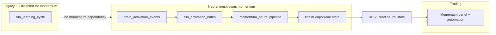

# Coinbase momentum + automation — **neural mode only**

## Non-negotiable architectural directive

- **Do not** use the learning-cycle as the implementation surface for momentum.
- **Do not** add momentum logic to [`learning.py`](app/services/trading/learning.py) or [`learning_cycle_architecture.py`](app/services/trading/learning_cycle_architecture.py).
- **Do not** depend on `run_learning_cycle` for momentum intelligence.
- **Treat LC as disabled / legacy** for this feature: no LC outputs as source of truth for momentum.
- **Primary owner:** neural mesh, brain graph projection, `BrainGraphNode` / `BrainGraphEdge` / `BrainNodeState`, activation queue + [`run_activation_batch`](app/services/trading/brain_neural_mesh/activation_runner.py), [`brain_neural_mesh`](app/services/trading/brain_neural_mesh/) publishers and handlers.
- **Trading page:** operator UX and automation controls only.
- **Coinbase:** execution venue layer (Phase 3+).
- **Config:** prefer `TRADING_BRAIN_NEURAL_MESH_ENABLED=1` and `trading_brain_graph_mode=neural` when using this feature; optional `CHILI_MOMENTUM_NEURAL_ENABLED` (to add) as feature gate.

If legacy routes or UI still imply LC ownership, **rehome** behavior to neural services or add **thin shims** that delegate to neural code without duplicating intelligence.

---

## Phase 0 — Audit (completed; classify only)

### A) Legacy / disabled learning-cycle path (non-owner for momentum)

| Area | Location | Notes |
|------|----------|--------|
| Orchestrator | [`app/services/trading/learning.py`](app/services/trading/learning.py) | `run_learning_cycle` — **no new momentum code** |
| Pipeline graph metadata | [`learning_cycle_architecture.py`](app/services/trading/learning_cycle_architecture.py) | Legacy network-graph narrative — **not extended for momentum** |
| LC → mesh bridge (existing) | [`publisher.publish_learning_cycle_completed`](app/services/trading/brain_neural_mesh/publisher.py) | Compatibility event only; **not** momentum source |
| Scheduler jobs feeding LC inputs | [`trading_scheduler.py`](app/services/trading/trading_scheduler.py) | Prescreen/scan/snapshots — may remain; momentum must not require LC |
| API | `POST /api/trading/learn/cycle`, brain learn endpoints | Legacy operator paths — **shim later** if responses must expose neural-backed status |

### B) Active / target neural path (momentum owner)

| Area | Location | Notes |
|------|----------|--------|
| Mesh core | [`app/services/trading/brain_neural_mesh/`](app/services/trading/brain_neural_mesh/) | `enqueue_activation`, `run_activation_batch`, [`propagation.py`](app/services/trading/brain_neural_mesh/propagation.py) |
| Desk / graph mode | [`schema.py`](app/services/trading/brain_neural_mesh/schema.py) | `effective_graph_mode()`, `desk_graph_boot_config()` |
| Graph JSON | [`projection.py`](app/services/trading/brain_neural_mesh/projection.py) | Neural UI projection — extend for momentum node previews |
| Layout | [`layout_neural_graph.py`](app/services/trading/brain_neural_mesh/layout_neural_graph.py) | `HUB_IDS` — optional hub for `nm_momentum_crypto_intel` |
| Persistence | [`app/models/trading.py`](app/models/trading.py) | `BrainGraphNode`, `BrainGraphEdge`, `BrainNodeState`, `BrainActivationEvent` |
| Worker | [`scripts/brain_worker.py`](scripts/brain_worker.py) | `activation-loop`; `_maybe_run_neural_activation_batch` |
| Existing mesh node | `nm_momentum` (migration 086) | Feature-layer node; Phase 1 adds **crypto momentum intel** subgraph |

### C) Compatibility bridges (minimal)

| Bridge | Purpose |
|--------|---------|
| `publish_market_snapshots_refreshed` | Scheduler/snapshots → mesh; **extend** with `publish_momentum_context_refresh` (neural-only enqueue) — **no LC** |
| Stable public JSON on existing brain/trading GETs | Rehome internals to neural services when touched |

### Inventory (unchanged)

- Trading: [`app/routers/trading.py`](app/routers/trading.py), [`app/templates/trading.html`](app/templates/trading.html).
- Coinbase REST: [`coinbase_service.py`](app/services/coinbase_service.py) — no WS/L2 yet.
- Next migration after **`088_backtest_param_sets`**: **`089_momentum_neural_mesh`** (planned).

---

## Phase 1 — Neural-native momentum (specification for implementation)

**Deliverables:**

1. **Migration `089_momentum_neural_mesh`** — idempotent inserts:
   - Nodes: `nm_momentum_crypto_intel` (hub), `nm_momentum_viability_pool` (observer), `nm_momentum_evolution_trace` (observer); `display_meta` includes `execution_family: coinbase_spot` seam.
   - Edges: `nm_event_bus` → intel (`momentum_context_refresh`); intel → viability/evolution (`momentum_scored`); `nm_momentum` → intel (`feature_signal`).
   - `brain_node_states` rows ON CONFLICT DO NOTHING.

2. **Package** `app/services/trading/momentum_neural/`:
   - `context.py` — regime/session (UTC crypto sessions), vol/chop/spread/fee/liquidity/exhaustion/rolling range/breakout continuity.
   - `features.py` — `ExecutionReadinessFeatures` (spread, imbalance stubs, slippage estimate, fee-to-target).
   - `variants.py` — versioned strategy **families** (impulse breakout, micro pullback, range high, reclaim, VWAP/EMA reclaim, compression→expansion, follow-through scalp, failed breakout bailout, no-follow-through exit).
   - `viability.py` — symbol×family scoring, rationale, paper vs live eligibility, freshness placeholders.
   - `evolution.py` — rolling aggregates / demotion hooks (neural-owned; **no** LC).
   - `telemetry.py` — structured logging prefix `[momentum_neural]`.
   - `pipeline.py` — `maybe_run_momentum_neural_tick(db, activation_event)` after activation processing when `cause`/payload matches; writes `BrainNodeState.local_state` for hub + viability pool.

3. **Wiring**
   - [`config.py`](app/config.py): `chili_momentum_neural_enabled: bool = True` (`CHILI_MOMENTUM_NEURAL_ENABLED`).
   - [`publisher.py`](app/services/trading/brain_neural_mesh/publisher.py): `publish_momentum_context_refresh` enqueue from `nm_event_bus`; call from `publish_market_snapshots_refreshed` when mesh + momentum flags on.
   - [`activation_runner.py`](app/services/trading/brain_neural_mesh/activation_runner.py): after successful `propagate_one_event`, call `maybe_run_momentum_neural_tick`.

4. **Projection** — optional `momentum_preview` on nodes whose `local_state` contains `momentum_neural_version`.

5. **Tests** — `tests/test_momentum_neural.py`: unit tests for context, variants registry, viability scoring (no DB or mocked Session).

---

## Phases 2–12

Unchanged from prior product spec (minimal schema, Coinbase adapter, Trading UX, automation surface, risk, paper, live, feedback, brain neural UI, arbitrage seam TODOs, tests/docs) with **all intelligence on neural path**.

---

## Architecture diagram (neural-only)

