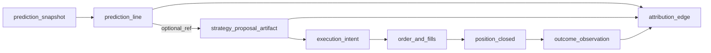

# CHILI trading-brain — canonical blueprint (Pass 1 + Pass 2 + Phase 1)

**Single source of truth** for trading-brain rearchitecture. Supersedes standalone copies of the Pass 2 supplement and Phase 1 package for planning purposes; those files now point here.

**Frozen architectural decisions:** dedicated trading-brain service (target); main app keeps product-facing trading UX; brain owns intelligence; brain owns market data for intelligence workflows; brain owns its own DB (target); HTTP + async events; scheduler/control plane + explicit stage jobs; **official** predictions from persisted snapshots (target); live recompute only admin/debug; learning cycle = coordinator of stage jobs; C+ pattern governance (definition / evaluation / lifecycle / allocation); patterns primary decision authority; models versioned and advisory; proposals distinct artifacts; lightweight risk guardrails; structured artifacts + decision trails; replayable/time-versioned artifacts; universes + regime first-class; shared feature layer; layered Product / Admin / Research APIs; auditable operator overrides; internal activation ≠ publication; selective events; phased extraction; strong verification; first-class observability.

---

## Part A — Current-state audit (code-grounded)

### A.1 Entrypoints

| Kind | Location | Notes |
|------|----------|--------|
| Learning cycle | [`run_learning_cycle`](app/services/trading/learning.py) (~7k-line module) | Single function sequences ~25 steps; updates in-process `_learning_status`; intermittent `db.commit()` via `_commit_step`. |
| Worker | [`scripts/brain_worker.py`](scripts/brain_worker.py) | Loop + file signals (`brain_worker_*`) + DB [`BrainWorkerControl`](app/models/core.py); optional remote via `CHILI_USE_BRAIN_SERVICE` → [`brain_client.run_learning_cycle_via_brain_service`](app/services/brain_client.py). |
| Brain HTTP | [`chili-brain/chili_brain_service/main.py`](chili-brain/chili_brain_service/main.py) | POST `/v1/run-learning-cycle` uses **same** `SessionLocal` + `run_learning_cycle` — not a separate intelligence DB. |
| Scheduler | [`app/services/trading_scheduler.py`](app/services/trading_scheduler.py) | Full trading learning job **disabled**; worker is canonical driver. |
| Predictions | [`get_current_predictions`](app/services/trading/learning.py) | Used from [`trading_sub/ai.py`](app/routers/trading_sub/ai.py), [`scanner.py`](app/services/trading/scanner.py). |
| Manual triggers | [`app/routers/trading.py`](app/routers/trading.py), [`trading_sub/ai.py`](app/routers/trading_sub/ai.py) | `ts.run_learning_cycle(...)`. |
| Status / compat | [`brain_v1_compat.py`](app/routers/brain_v1_compat.py), worker JSON | Merges `get_learning_status()` + `data/brain_worker_status.json`. |

### A.2 Coupling and risks

- **God module:** Orchestration, I/O, promotion, ML, proposals coexist in `learning.py`.
- **Process-local state:** `_learning_status`, `_pred_cache`, `_shutting_down` — not shared across uvicorn workers / containers; stale-timeout clears “running” ([`L6912+`](app/services/trading/learning.py)).
- **Shared DB:** Intelligence and product share [`app/models/trading.py`](app/models/trading.py) (`scan_patterns`, `trading_proposals`, `trading_trades`, `PatternTradeRow`, …).
- **Predictions:** In-memory SWR (`_PRED_CACHE_TTL` 180s, stale 600s); **no** immutable snapshot authority.
- **Dual control:** File + DB + Docker liveness paths in worker UI — operators must know which applies.

### A.3 Persistence touchpoints (today)

- Patterns: `ScanPattern` + `promotion_status` + JSONB OOS/paper fields.
- Proposals/trades: `StrategyProposal`, `Trade` (incl. `strategy_proposal_id`, `scan_pattern_id`, TCA columns).
- Learning log: `LearningEvent`; cycle narrative: learning cycle AI report migration path.
- Worker: `brain_worker_control` row; status JSON on disk.

### A.4 Top failure modes (architecture-level)

Overlapping cycles (API + worker + remote), partial cycle ambiguity, stale multi-worker prediction cache, promotion races on same pattern row, weak replay/as-of (no snapshot ids), opaque ML influence without version linkage.

---

## Part B — Target architecture (summary)

**Services:** `chili-main` (auth, UI, portfolio, watchlists, execution UX) ↔ **trading-brain-service** (intelligence, market data for brain jobs, brain DB).

**Internal modules (target):** `market_data`, `universes`, `features`, `regime`, `patterns` (definition / evaluation / lifecycle / allocation), `predictions`, `proposals`, `learning` (coordinator only), `models`, `policies`, `artifacts`, `jobs`, `publication`, `operator_controls`, `telemetry`, `replay`.

**APIs:** Product (published reads), Admin/Control (cycle, overrides, publication), Research (replay, artifacts, experiments) — see **Part F**.

**Execution:** Scheduler enqueues **stage_job** DAG; workers lease jobs; learning coordinator aggregates; publication job separates internal activation from product-visible output.

---

## Part C — Outcome feedback model (explicit chain)

### C.1 End-to-end chain (artifacts and FK direction)

**Narrative (single thread):**

1. **`prediction_snapshot`** — Header: `as_of_ts`, `universe_id`, `regime_snapshot_id`, `allocation_snapshot_id`, `model_version_ids[]`, `freshness_class`, `correlation_id`. Immutable after seal.
2. **`prediction_line`** — One row per ticker (or instrument): score, `decision_trace_artifact_id` (matched patterns, policy snapshot, model deltas). FK → `prediction_snapshot.id`. Optional FK → future `opportunity_signal` for internal-only candidates.
3. **`strategy_proposal_artifact`** (brain) — Distinct from main-app inbox row: `horizon_spec`, levels, `source_prediction_line_id` (preferred) or `source_snapshot_id` + ticker; states: `draft_internal` → `candidate` → `published` → `acted` | `expired` | `suppressed` | `retracted`.
4. **`execution_intent`** — `proposal_artifact_id`, `account_mode` (`paper`|`live`), `target_qty`, `limit_px?`, `intent_id` stable for broker. Emitted when user/system commits to trade.
5. **`order_update` / `fill` rows** (normalized from `execution.order_update`, `execution.fill` events) — `intent_id`, `broker_order_id`, cumulative `filled_qty`, each fill: `qty`, `px`, `fees`, optional liquidity; supports **partial** fills as a sequence until terminal order state.
6. **`position_closed`** (event + row) — Flat or horizon exit: `exit_px`, `exit_ts`, `realized_pnl`, `holding_bars`; links to `intent_id` / internal `trade_id` mirror from main app.
7. **`outcome_observation`** — Locked row: `source_ref` = (`prediction_line_id` **or** `proposal_artifact_id`), `horizon_name`, `label_cutoff_ts`, `decision_px` (policy-chosen: publish ref vs first-fill), `return`, optional MFE/MAE, `label_win`. **Immutable** after lock. Learning consumes only if `label_cutoff_ts < consumer_job_as_of_ts`.
8. **`attribution_edge`** — Directed edges: parent = `prediction_line` or `proposal_artifact`; child = `pattern_definition_version` | `model_version` | `policy_rule_set_version`; `weight`, `method` (`uniform_over_matched_patterns` | `rule_contribution` | `shapley_approx`); `evidence_artifact_id` points to frozen decision trace.

**Paper vs live:** `account_mode` on `execution_intent` and carried into outcome rollups; shadow lifecycle may consume paper only.

### C.2 Events (main → brain envelope)

`event_id`, `occurred_at`, `idempotency_key`, `correlation_id`, `schema_version`, `event_type`, `payload`.

| `event_type` | Produces/updates |
|--------------|------------------|
| `proposal.published` | Proposal artifact `published` |
| `proposal.status_changed` | State transitions |
| `execution.intent_recorded` | `execution_intent` row |
| `execution.order_update` | Order aggregate state |
| `execution.fill` | Fill row(s); partial fill support |
| `execution.position_closed` | Triggers `outcome_observation` materialization when horizon rules satisfied |
| `proposal.cancelled` | Terminal proposal; partial outcome rules per policy |

Internal: `OutcomeObservationReady` when `label_cutoff_ts` computed and bars available — still subject to anti-leakage filters.

### C.3 Anti-hindsight

- `data_cutoff_ts` on all training/feature jobs; market_data rejects `ts > cutoff`.
- Outcome rows feed **next** train/eval runs only after lock (DAG edge).
- Policy: **no** direct online update of deterministic gates from a single outcome (use aggregated `proposal_outcome_summary` / evaluation runs).

---

## Part D — Promotion and allocation policy framework (governance math)

### D.1 Layering

| Layer | Role |
|-------|------|
| **Deterministic gates** | Boolean predicates; any `false` → no promotion / no publication (depending on job). |
| **Deterministic base score** | Real-valued **base_weight** from OOS metrics, costs, liquidity (monotonic, clamped to `[w_min, w_max]`). |
| **Model-assisted tilt** | Bounded multiplicative factor on base_weight; **cannot** flip a failed gate to passed. |
| **Operator / suppress** | Overrides intersect policy (hard block or cap). |
| **Churn / hysteresis** | Temporal and delta constraints on **lifecycle** and **allocation** changes. |

### D.2 Deterministic policy (form)

Let gates \(G_1..G_k\) be booleans (OOS, evidence N, regime strata, liquidity, data quality). **Promotion eligible** iff:

\[
\text{promote\_ok} = \bigwedge_{i=1}^{k} G_i \quad \land \quad \text{ChurnGuard} \quad \land \quad \neg \text{OperatorSuppress}
\]

**Publication eligible** (stricter or equal):

\[
\text{publish\_ok} = \text{promote\_ok} \land \text{PublicationPolicy} \land \text{RegimePublicationRule}
\]

Each gate writes an append-only **`policy_evaluation_id`** fragment into `promotion_decision.module_results`.

### D.3 Model-assisted (form)

Let `base_weight` be from deterministic layer. Let `rank_score` ∈ [0,1] from `ModelAssistRanker` (meta-learner or calibrated score). Define tilt:

\[
\text{tilt} = \text{clamp}\bigl(1 + \alpha \cdot (2 \cdot \text{rank\_score} - 1),\ \text{tilt\_min},\ \text{tilt\_max}\bigr)
\]

with recommended **`tilt_min=0.85`, `tilt_max=1.15`**, **`α ≤ 0.15`** so models **reorder within band** but do not dominate. Final allocation weight:

\[
w = \text{clamp}(\text{base\_weight} \cdot \text{tilt},\ w_{\min},\, w_{\max})
\]

**Invariant:** If any hard gate fails, **`w` is not applied** to published allocation (pattern may stay internal shadow only).

### D.4 Churn prevention (operational)

- **Dwell time:** Minimum calendar time in `probationary` before `active` (e.g. 7d, configurable per `hypothesis_family`).
- **Transition budget:** Max **N** promote/demote events per pattern per rolling window (e.g. 14d) unless `operator_override` or `severity_1_data_incident`.
- **Hysteresis on metrics:** Promotion requires metric ≥ **upper threshold**; demotion requires ≤ **lower threshold** with **lower < upper** (dead band).
- **Regime:** Use regime-specific metrics; switching regime does not instantly demote unless **RegimeConditionalPolicy** fails **and** churn guard allows transition.

### D.5 Internal activation vs publication

- **Lifecycle `active`** allows internal scoring and candidate proposals.
- **`publish_ok`** gates product-visible predictions/proposals and allocation caps exposed to UI.

### D.6 Append-only decision record

Every transition writes `promotion_decision` / `lifecycle_transition` with `policy_bundle_version`, full `module_results[]`, optional `model_advisory` `{rank_score, model_version_id}`, optional `operator_override_id`.

---

## Part E — Artifact retention and storage lifecycle (matrix)

**Column legend:** **Hot** = default OLTP query window; **Warm** = same DB, partitions/compression or secondary indexes; **Cold** = object store + DB index row; **Immut** = immutability after seal; **Query** = primary query surface (ops / analytics / legal).

| Artifact class | Default hot TTL | Warm | Cold | Immut | Query (default) | Compaction / notes |
|----------------|-----------------|------|------|-------|-----------------|---------------------|
| Raw quote/bar cache | 24–72h | 14d | 90d summary | No | Ops | Drop hot after cold aggregate |
| OHLCV intelligence store | 30–90d | 1y | Multi-year Parquet | Bars immutable | Ops + replay | Partition by month |
| Regime snapshots | 90d detail | 2y | Forever headers | Yes (sealed) | Ops | Tiny rows |
| Feature materializations | 7–30d | 90d | Per cycle archive | Sealed version yes | Research | Drop hot after downstream seal |
| Stage-job stdout / debug blobs | 7d | 30d | 180d | No | Ops | Digest + blob URI |
| `learning_cycle_run` header | Forever | — | — | Yes | Ops | — |
| Stage-job rows (terminal) | 90d | 2y | 5y | Outcome immutable | Ops | Archive old to cold JSON |
| Learning cycle summary artifacts | 90d | 2y | Forever | Yes | Research | — |
| Prediction snapshot (published) | Forever header | — | Large JSON >1y | Yes | Product + ops | Blob offload body |
| Prediction line | With snapshot | — | With snapshot | Yes | Product + replay | — |
| Proposal artifact (internal) | 30d | 1y | 7y | Yes after publish | Ops | — |
| Pattern evaluation runs | 180d detail | 2y | Forever | Yes | Research | Roll up raw to monthly |
| Pattern trade rows (`PatternTradeRow`-class) | 180d | 2y | Cold samples | Yes | Research | Keep last N raw per pattern |
| Retired pattern definition | Forever | — | Heavy JSON cold | Yes | Ops | Trim JSON to summary |
| Model artifacts (pickle/onnx) | Current + N−3 | Older in blob | — | Version immutable | Ops | N configurable |
| Replay/simulation outputs | 14d | 90d | 1y | Yes | Research | Purge |
| Integration / outbox events | 7d pending | 90d processed | 1y | Yes processed | Ops | Archive |
| Operator audit / overrides | Forever | — | — | Yes | Security | — |
| Promotion decisions | Forever | — | — | Yes | Ops + research | — |
| Outcome observations (sealed) | Forever | — | — | Yes | Research | — |

**Evolution:** relational JSONB + `content_hash` now; add `storage_uri` later for cold bodies without losing audit hashes.

---

## Part F — Security and trust boundaries

### F.1 Trust zones (recap)

Browser → **main only**; main → brain **Product API** (server-side); operator automation → main → brain **Admin**; research tools → **Research API** on private network; workers → data plane (DB, vendors), no public inbound.

### F.2 API scope definitions

| API tier | Audience | Transport | AuthN | AuthZ scopes | Rate limit | Network |
|----------|----------|-----------|-------|--------------|------------|---------|
| **Product** | Main app BFF only | HTTPS / mTLS optional | Client-credential JWT or mTLS; **no** browser token | `brain:product:read`, optional `brain:product:read_snapshots` | Standard | DMZ / same VPC as main |
| **Admin / Control** | Main app operator backend, automation | HTTPS + mTLS preferred | JWT with short TTL + `jti` | `brain:admin:cycle`, `brain:admin:override`, `brain:admin:publish`, `brain:admin:read_jobs` | **Stricter** than Product | Private admin subnet only |
| **Research** | Researchers / tooling | HTTPS | JWT + optional VPN | `brain:research:artifact_read`, `brain:research:replay`, `brain:research:experiment` | Low QPS, burst allowed | **Bind 127.0.0.1** or allowlist CIDR; default **disabled** in prod (`RESEARCH_API_ENABLED=0`) |

**S2S:** mTLS **or** HMAC (`X-Chili-Signature`, `X-Chili-Timestamp` ± skew) on all brain ingress from main.

**Events:** HMAC body hash; `idempotency_key` dedup 48h; only **`execution_adapter`** principal may emit `execution.*`.

**Privileged misuse:** Dangerous routes require `brain:admin:dangerous` + feature flag; dual-control optional for kill-switch / forced publish.

---

## Part G — Migration phases: acceptance criteria and rollback triggers

| Phase | Done means (measurable) | Success metrics / invariants | Rollback trigger | Rollback action |
|-------|-------------------------|------------------------------|------------------|-----------------|
| **0 — Seams** | `BrainFacade` (or `TradingBrainFacade`) is only trading-router entry to brain orchestration; CI grep blocks new `from app.services.trading.learning import run_learning_cycle` from `app/routers/` | 0 new violations on `main` in 14d | Facade breaks build | Revert facade PR; no schema dependency |
| **1 — Cycle + stage rows** | Every `run_learning_cycle` creates `brain_learning_cycle_run` + N `brain_stage_job`; `get_learning_status` can **read** same from DB (dual-read OK) | 100% cycles have all stage rows or `skipped`+reason; `stale_failed` if `running` > `learning_cycle_stale_seconds` | Migration failure or >5% cycle insert errors | Feature flag: ignore brain tables; old dict only |
| **2 — Single-flight** | `brain_cycle_lease` (or advisory lock) enforces ≤1 `running` per `scope_key` | 0 overlapping `running` cycles in 7d soak | Lock contention > SLO | Single worker; disable second replica |
| **3 — Prediction dual-write** | Published path writes `prediction_snapshot` + lines | 50-ticker sample: score Δ ≤ ε vs legacy same bar; p95 publish lag < 120s | Parity failure > ε for >5% sample | Disable dual-write reads |
| **4 — Snapshots authoritative** | Product never calls `_get_current_predictions_impl` for published surface | All product responses include `snapshot_id`, `freshness_class` | Incident: stale snapshot > 2× SLO | Emergency flag to legacy live path |
| **5 — Outcomes** | Main emits execution events; brain materializes outcomes | ≥95% proposal→outcome join 30d; 0 future `label_cutoff_ts` vs consumer `as_of` | HMAC failure spike | Pause event ingest; backtest-only promotion |
| **6 — Brain DB** | Intelligence migrations run on brain `DATABASE_URL` | Replay parity ≥99% sample within ε | Brain DB unavailable > T | Read-only degrade to main replica |

**Global rollback signals:** publication paused >15m; replay parity drop > threshold; forge rate spike → read-only + halt promotion.

---

## Part H — Phase 1 implementation package (scaffolding only)

**Goal:** Tables + ports + schemas + stage catalog **without** wiring `run_learning_cycle`, routers, or worker.

**New tree:** [`app/trading_brain/`](app/trading_brain/) — `ports/`, `schemas/`, `infrastructure/repositories/`, `README.md`, `stage_catalog.py`.

**Models:** [`app/models/trading_brain_phase1.py`](app/models/trading_brain_phase1.py) — `BrainLearningCycleRun`, `BrainStageJob`, `BrainCycleLease`, `BrainIntegrationEvent`.

**Migrations in** [`app/migrations.py`](app/migrations.py): `048_brain_learning_cycle_tables`, `049_brain_cycle_lease`, `050_brain_integration_event` (append to `MIGRATIONS` after current `047_*`).

**Protocols:** `BrainLearningCycleRunRepository`, `BrainStageJobRepository`, `BrainCycleLeasePort`, `BrainIntegrationEventStore`, `BrainLearningStatusPort` (signatures as in prior Phase 1 doc).

**Out of scope Phase 1:** behavioral rewrites, router cutover, worker changes, second DB, prediction snapshots, outcome processing beyond idempotency table, `docs/migrations/brain_phase1.sql`, `trading_brain_facade.py`.

**Execution:** Follow **Part L (frozen)**; Part K mirrors file order.

---

## Part I — Immediate refactors (post-scaffold, pre–full extraction)

1. Thin **execution/outcome emitter** in main: `Trade` / `StrategyProposal` / broker hooks → event envelope (no brain required to start).
2. **Persist decision trace** on prediction path (matched patterns at freeze).
3. Formal **`horizon_spec`** beyond `StrategyProposal.timeframe` string.
4. **`policy_bundle_version`** file (hashable) checked into repo.
5. **Retention worker** skeleton (no-op cron).
6. Document **JWT scopes** for future brain routes in main config.
7. Shared **evaluation window** helper for OOS backtest vs live outcomes.
8. **CODEOWNERS** on `app/services/trading/learning.py` + `app/trading_brain/`.

---

## Part J — Open questions / assumptions

- Broker webhooks stay on **main**; brain ingests **events** only (default assumption).
- Multi-horizon outcomes: **separate rows** per `(horizon_name, label_cutoff_ts)` recommended.
- **Crypto vs equity** session calendar for `label_cutoff_ts`.
- Short/borrow not modeled everywhere — policy may no-op for shorts until fields exist.
- SQLite dev: document **single worker**; no `SKIP LOCKED` until Postgres.

---

## Part K — First execution-ready implementation sequence (Phase 1 only)

**Rules:** No behavioral rewrites; no router cutovers; no worker rewrites. Scaffolding compiles and migrations apply on fresh Postgres.

**Authoritative checklist:** **Part L (frozen)** is the single execution checklist. Part K below is a compact mirror; if K and L ever disagree, **L wins**.

### K.1 Files to **create** (in order) — 18 files, no optional rows

| Step | Path | Purpose |
|------|------|---------|
| 1 | `app/trading_brain/__init__.py` | Package marker (minimal) |
| 2 | `app/trading_brain/README.md` | Scope + non-goals + rollback note |
| 3 | `app/trading_brain/stage_catalog.py` | `STAGE_KEYS`, `TOTAL_STAGES` only |
| 4 | `app/trading_brain/schemas/__init__.py` | Re-exports |
| 5 | `app/trading_brain/schemas/cycle.py` | Enums + DTOs |
| 6 | `app/trading_brain/schemas/status.py` | `LearningStatusDTO` |
| 7 | `app/trading_brain/schemas/events.py` | `IntegrationEventEnvelope` + stub payloads |
| 8 | `app/trading_brain/ports/__init__.py` | Re-exports |
| 9 | `app/trading_brain/ports/cycle_repository.py` | Protocols |
| 10 | `app/trading_brain/ports/cycle_lease.py` | Protocol |
| 11 | `app/trading_brain/ports/integration_events.py` | Protocol |
| 12 | `app/trading_brain/ports/learning_status.py` | Protocol |
| 13 | `app/trading_brain/infrastructure/__init__.py` | Package |
| 14 | `app/trading_brain/infrastructure/repositories/__init__.py` | Package |
| 15 | `app/trading_brain/infrastructure/repositories/cycle_sqlalchemy.py` | Stub |
| 16 | `app/trading_brain/infrastructure/lease_sqlalchemy.py` | Stub |
| 17 | `app/trading_brain/infrastructure/integration_sqlalchemy.py` | Stub |
| 18 | `app/models/trading_brain_phase1.py` | SQLAlchemy models (4 tables) |

**Not in Phase 1:** `docs/migrations/brain_phase1.sql` (**OUT** — DDL source is `app/migrations.py` only). `app/services/trading_brain_facade.py` (**OUT**).

### K.2 Files to **modify** (exactly 2)

| Step | Path | Change |
|------|------|--------|
| 1 | [`app/migrations.py`](app/migrations.py) | Add `_migration_048_*`, `_migration_049_*`, `_migration_050_*` + append 3 tuples to `MIGRATIONS` |
| 2 | [`app/models/__init__.py`](app/models/__init__.py) | **Required:** import the four new models and append to `__all__` (matches existing re-export pattern). |

**Do not modify in Phase 1:** `app/routers/*`, `scripts/brain_worker.py`, `app/services/trading/learning.py`, `app/services/brain_client.py`, `chili-brain/*`, [`app/main.py`](app/main.py) (default: no new brain imports).

### K.3 Order of work (dependency-safe)

1. **Stage catalog** (`stage_catalog.py`) — no deps.
2. **Pydantic schemas** (`schemas/cycle.py` → `status.py` → `events.py`) — avoid circular imports (schemas do not import infrastructure).
3. **Protocols** (`ports/*.py`) — import Session + schema DTOs.
4. **SQLAlchemy models** (`trading_brain_phase1.py`) — `Base` from [`app/db.py`](app/db.py).
5. **Migrations** in `migrations.py` — align with ORM `__tablename__` / columns.
6. **Repository stubs** — `NotImplementedError` or empty bodies; **not** referenced from routers/worker/learning.
7. **`models/__init__.py`** export.
8. **Verify** per Part L “Definition of done” and “Verification”.

### K.4 Migration order (must stay sequential)

1. `048_brain_learning_cycle_tables` — `brain_learning_cycle_run`, `brain_stage_job`, indexes, FK.
2. `049_brain_cycle_lease` — `brain_cycle_lease` + seed `scope_key='global'` if using singleton pattern.
3. `050_brain_integration_event` — `brain_integration_event`.

### K.5 Scaffold PR definition of done

Use **Part L — Definition of done** and **Verification** subsections (frozen). Part K does not duplicate them.

---

## Part L — Phase 1 scaffolding execution checklist (**FROZEN / APPROVED**)

**Status:** Approved for execution. Phase 1 is **fully deterministic** — no optional files or extra modify steps.

**Renumbering rule:** Migration IDs **`048` / `049` / `050`** assume [`app/migrations.py`](app/migrations.py) ends at **`047_scan_pattern_research_quant_columns`**. If a higher migration exists when work starts, **renumber** `version_id` and `_migration_NNN_*` names to append **after** the current tail — never skip sequence numbers.

### Phase 1 scope decisions (no ambiguity)

| Item | In / Out | Rationale |
|------|-----------|-----------|
| `docs/migrations/brain_phase1.sql` | **OUT** | Avoid DDL drift; [`app/migrations.py`](app/migrations.py) is the only authoritative schema application path in this repo. |
| `app/services/trading_brain_facade.py` | **OUT** | Facade is integration wiring; Phase 1 is inert scaffolding only. |
| [`app/models/__init__.py`](app/models/__init__.py) changes | **IN** | Project standard is `from app.models import …` + `__all__`; add all four new ORM classes. |

**Boundaries:** **Part I** = post-scaffold (not Phase 1). **Part C** outcome **pipeline** = not Phase 1; Phase 1 adds **stub Pydantic types** + **`brain_integration_event` table** for **future** idempotency only (no emitters, consumers, HMAC).

### Phase 1 objective

Add **four `brain_*` tables**, **`app/trading_brain/`** package (ports, schemas, inert repository stubs, stage catalog), and **migrations 048–050**, plus **model re-exports**. **Zero** runtime behavior change to learning, predictions, worker, or HTTP.

### Phase 1 non-goals (explicit)

Phase 1 **does not** include: event **emitters** or **consumers**; outcome feedback wiring; prediction snapshot tables; publication logic; **runtime** worker lease enforcement; router/API integration; replacing `_learning_status` or `get_learning_status`; replacing `run_learning_cycle` orchestration; `TradingBrainFacade` or any production use of repository stubs.

### Files to create, in exact order (18)

1. `app/trading_brain/__init__.py`
2. `app/trading_brain/README.md`
3. `app/trading_brain/stage_catalog.py`
4. `app/trading_brain/schemas/__init__.py`
5. `app/trading_brain/schemas/cycle.py`
6. `app/trading_brain/schemas/status.py`
7. `app/trading_brain/schemas/events.py`
8. `app/trading_brain/ports/__init__.py`
9. `app/trading_brain/ports/cycle_repository.py`
10. `app/trading_brain/ports/cycle_lease.py`
11. `app/trading_brain/ports/integration_events.py`
12. `app/trading_brain/ports/learning_status.py`
13. `app/trading_brain/infrastructure/__init__.py`
14. `app/trading_brain/infrastructure/repositories/__init__.py`
15. `app/trading_brain/infrastructure/repositories/cycle_sqlalchemy.py`
16. `app/trading_brain/infrastructure/lease_sqlalchemy.py`
17. `app/trading_brain/infrastructure/integration_sqlalchemy.py`
18. `app/models/trading_brain_phase1.py`

### Files to modify, in exact order (2 only)

1. [`app/migrations.py`](app/migrations.py) — `_migration_048_brain_learning_cycle_tables`, `_migration_049_brain_cycle_lease`, `_migration_050_brain_integration_event`; append three entries to `MIGRATIONS`.
2. [`app/models/__init__.py`](app/models/__init__.py) — import `BrainCycleLease`, `BrainIntegrationEvent`, `BrainLearningCycleRun`, `BrainStageJob` from `.trading_brain_phase1`; add all four to `__all__`.

**No other files** may be changed in Phase 1.

### Schema / migration order

1. **048** — `brain_learning_cycle_run`, `brain_stage_job` (+ FK, indexes).
2. **049** — `brain_cycle_lease` (+ seed `scope_key='global'` if singleton row pattern).
3. **050** — `brain_integration_event`.

### Interface / protocol creation order

1. `ports/cycle_repository.py` — `BrainLearningCycleRunRepository`, `BrainStageJobRepository`
2. `ports/cycle_lease.py` — `BrainCycleLeasePort`
3. `ports/integration_events.py` — `BrainIntegrationEventStore`
4. `ports/learning_status.py` — `BrainLearningStatusPort`

### Repository scaffolding order

1. `infrastructure/repositories/cycle_sqlalchemy.py`
2. `infrastructure/lease_sqlalchemy.py`
3. `infrastructure/integration_sqlalchemy.py`

Stubs must **not** be imported from production paths (routers, `learning.py`, `brain_worker.py`, `main.py`).

### Event definitions to add now

In `app/trading_brain/schemas/events.py` only: **`IntegrationEventEnvelope`** (Part C.2 fields); stub payload types for `proposal.published`, `proposal.status_changed`, `execution.intent_recorded`, `execution.order_update`, `execution.fill`, `execution.position_closed`, `proposal.cancelled`. No runtime consumers.

### Models / entities to add now

`app/models/trading_brain_phase1.py`: `BrainLearningCycleRun`, `BrainStageJob`, `BrainCycleLease`, `BrainIntegrationEvent` → tables `brain_learning_cycle_run`, `brain_stage_job`, `brain_cycle_lease`, `brain_integration_event`. **No** prediction/outcome/attribution tables.

### What stays untouched

[`app/routers/`](app/routers/) (including **no import changes**), [`scripts/brain_worker.py`](scripts/brain_worker.py), [`app/services/trading/learning.py`](app/services/trading/learning.py), [`app/services/brain_client.py`](app/services/brain_client.py), [`chili-brain/`](chili-brain/), [`app/main.py`](app/main.py) (default: no new `trading_brain` imports).

### Risks in Phase 1

- **Migration numbering drift** — renumber if tail ≠ 047.
- **SQLite vs Postgres** — JSONB / `SKIP LOCKED`; document in README.
- **Scope creep** — Part I items must not ship in this PR.
- **Accidental coupling** — `learning.py` / worker / routers importing `app.trading_brain` or stubs; **forbidden**.
- **Naming drift** — ORM `__tablename__` / columns must match migrations and stay **`brain_*`** for forward compatibility with prediction/outcome phases.
- **Premature stub use** — any repository call from API/worker/learning before Phase 2 — reject in review.
- **Schema collisions later** — avoid unprefixed generic table names; keep **`brain_`** prefix on all Phase 1 tables.

### Definition of done for Phase 1

- [ ] Exactly **18** create files exist; exactly **2** files modified (`migrations.py`, `models/__init__.py`).

#### Verification (required)

- [ ] **Migrations — apply:** On **fresh** Postgres, `run_migrations` applies **048 → 049 → 050** without error; `schema_version` lists those three `version_id`s.
- [ ] **Migrations — rollback documented:** `README.md` states: preferred rollback is **revert PR**; for **disposable dev DBs** only, manual recovery may delete the three `version_id` rows from `schema_version` and `DROP` the four `brain_*` tables — **no** down-migration shipped in Phase 1; never partial-drop on shared/prod without policy.
- [ ] **Models import:** `from app.models import BrainLearningCycleRun, BrainStageJob, BrainCycleLease, BrainIntegrationEvent` works; app **does not** require these tables on the critical path for existing requests (tables may remain empty).
- [ ] **Routers unchanged:** `rg trading_brain|BrainLearningCycleRun|BrainStageJob` under `app/routers/` shows **no new hits** vs baseline (aside from any pre-existing unrelated matches).
- [ ] **Worker file unchanged:** `scripts/brain_worker.py` has **no** diff vs baseline.
- [ ] **Learning / prediction outputs:** No intentional change to `get_current_predictions` / `run_learning_cycle` behavior or API responses (smoke or existing tests unchanged).
- [ ] **Stubs isolated:** `rg cycle_sqlalchemy|lease_sqlalchemy|integration_sqlalchemy` limited to `app/trading_brain/` only (no matches under `app/routers/`, `app/services/trading/learning.py`, `scripts/`).
- [ ] **Lint / tests:** Project linters and a minimal test pass (e.g. `pytest` subset or CI-equivalent) succeed for touched paths.
- [ ] **README:** Phase 1 non-goals + SQLite caveats + rollback note present.

---

### Phase 1 implementation prompt (for executor)

Execute **Part L** of this file exactly.

**Create (order):** `app/trading_brain/__init__.py` → `README.md` → `stage_catalog.py` → `schemas/{__init__,cycle,status,events}.py` → `ports/{__init__,cycle_repository,cycle_lease,integration_events,learning_status}.py` → `infrastructure/__init__.py` → `infrastructure/repositories/{__init__,cycle_sqlalchemy}.py` → `infrastructure/{lease_sqlalchemy,integration_sqlalchemy}.py` → `app/models/trading_brain_phase1.py`.

**Modify (order):** [`app/migrations.py`](app/migrations.py) (048–050 + `MIGRATIONS`) → [`app/models/__init__.py`](app/models/__init__.py) (imports + `__all__`).

**Implement:** ORM models aligned with migrations; idempotent-style migration guards like existing `_tables`/`_columns` patterns; Protocols + Pydantic DTOs/enums; stub repository classes (`NotImplementedError`); `STAGE_KEYS`/`TOTAL_STAGES`; `events.py` envelope + seven stub payload types for Part C.2 strings; README with non-goals, SQLite limits, rollback.

**Do not:** add `brain_phase1.sql`, facade, touch routers/worker/learning/brain_client/chili-brain/main, wire stubs, emit/consume events, or change prediction/learning behavior.

**Done when:** Part L Definition of done + Verification checkboxes are satisfied.

---

## Part M — Phase 2 execution checklist (planning only; behavior-preserving)

**Inputs:** Parts **B**, **G**, **H**, **L**, **M** (this section); completed Phase 1 (real `brain_*` tables, ports, stubs in [`app/trading_brain/`](app/trading_brain/), models in [`app/models/trading_brain_phase1.py`](app/models/trading_brain_phase1.py)).

**Note vs canonical Part G row “Phase 2 — Single-flight”:** the global blueprint’s numeric “Phase 2” is **lease enforcement**. This **Part M Phase 2** is a **narrower engineering slice** approved for immediate work: **real repositories + shadow writes + dual-read**, with **legacy** remaining authoritative. **Enforcing** ≤1 running cycle via `brain_cycle_lease` (or changing worker overlap behavior) is **out of scope** here — defer to **Phase M-3** or blueprint **Part G Phase 2** after shadow data proves correct.

### Phase 2 objective

Replace Phase 1 **NotImplementedError** stubs with **working SQLAlchemy** implementations of the four ports, and add **thin, flag-guarded** hooks in [`app/services/trading/learning.py`](app/services/trading/learning.py) so that:

1. **`run_learning_cycle`** **mirrors** cycle + stage (+ optional non-blocking lease) state into `brain_*` tables as the legacy orchestration runs.
2. **`get_learning_status`** performs a **dual-read** (legacy `_learning_status` + DB) for **parity logging / metrics only**, returning **legacy-shaped output** as the sole user-visible source of truth.

No prediction, proposal, publication, router, worker orchestration, or event-consumer changes.

### Exact behavior boundaries

| Area | Legacy (authoritative) | Brain DB (Phase 2) |
|------|------------------------|-------------------|
| Whether a cycle runs / early-exit / stale “running” clear | `_learning_status`, existing logic in `run_learning_cycle` | Mirror rows only; **must not** change decisions |
| Step order, skips (e.g. secondary miners), durations | Existing code paths | Stage rows updated to match what actually ran (`skipped` + `skip_reason` where applicable) |
| Worker loop, sleep, retries | [`scripts/brain_worker.py`](scripts/brain_worker.py) | Unchanged; may indirectly trigger more mirror writes when learning runs |
| Predictions | `get_current_predictions`, caches | **No writes** to future snapshot tables; **no** logic changes |
| API responses | Routers unchanged | N/A |
| Lease / single-flight | Current process + file/DB worker signals | **Persist** lease row **for observability** only; **do not** block second cycle |

### What Phase 2 is allowed to change

- [`app/trading_brain/infrastructure/repositories/cycle_sqlalchemy.py`](app/trading_brain/infrastructure/repositories/cycle_sqlalchemy.py) — real `BrainLearningCycleRunRepository` + `BrainStageJobRepository` (split into two classes if clearer).
- [`app/trading_brain/infrastructure/lease_sqlalchemy.py`](app/trading_brain/infrastructure/lease_sqlalchemy.py) — real `BrainCycleLeasePort` (CRUD + optional `try_acquire` **without** being consulted for gating).
- [`app/trading_brain/infrastructure/integration_sqlalchemy.py`](app/trading_brain/infrastructure/integration_sqlalchemy.py) — real `BrainIntegrationEventStore` (idempotent insert + mark processed).
- **New** `BrainLearningStatusPort` implementation file (see create list).
- [`app/services/trading/learning.py`](app/services/trading/learning.py) — **only** additive/guarded calls into repositories + dual-read helper; **no** change to return contract of `run_learning_cycle` / public side effects beyond extra DB rows.
- [`app/config.py`](app/config.py) — boolean flags (e.g. `brain_cycle_shadow_write_enabled`, `brain_status_dual_read_enabled`, optional `brain_lease_shadow_write_enabled`).
- [`app/trading_brain/README.md`](app/trading_brain/README.md) — Phase 2 behavior, flags, rollback.
- **New tests** under `tests/` for repositories and optional dual-read logging.

### What Phase 2 must not change

- **Routers:** no edits under [`app/routers/`](app/routers/).
- **Worker:** no edits to [`scripts/brain_worker.py`](scripts/brain_worker.py) (still invokes learning as today).
- **Brain HTTP delegate:** no semantic change in [`chili-brain/`](chili-brain/) or [`app/services/brain_client.py`](app/services/brain_client.py).
- **`app/main.py`:** no new routes; brain wiring stays internal to learning or `app/trading_brain` factories.
- **Prediction path:** no changes to [`get_current_predictions`](app/services/trading/learning.py), `_pred_cache`, or snapshot tables (not created in Phase 2).
- **Orchestration:** no replacing the single `run_learning_cycle` pipeline with a job runner; no `claim_next_runnable` in production path unless **read-only** experiment (default **off**).
- **Event consumers:** nothing reads `brain_integration_event` except tests or manual ops.
- **Authoritative status:** `get_learning_status()` **must not** switch UI to DB-only state.

### Files to create, in exact order

1. `app/trading_brain/infrastructure/learning_status_sqlalchemy.py` — implements `BrainLearningStatusPort` (DB read + compare helper used by `get_learning_status`; **returns** `LearningStatusDTO` for internal compare only, or merge helper that takes legacy dict).
2. `app/trading_brain/wiring.py` — construct repository instances + read settings flags (keeps `learning.py` diff smaller; **no** global singletons that break tests — factory functions accepting `Session`).
3. `tests/test_trading_brain_repositories.py` — unit/integration tests against Postgres (`TEST_DATABASE_URL` / project test DB pattern).
4. *(Optional, if split preferred)* `app/trading_brain/infrastructure/repositories/stage_job_sqlalchemy.py` — only if cycle and stage repos are split from `cycle_sqlalchemy.py`; otherwise **omit** and keep one modify file.

### Files to modify, in exact order

1. [`app/trading_brain/infrastructure/repositories/cycle_sqlalchemy.py`](app/trading_brain/infrastructure/repositories/cycle_sqlalchemy.py) — replace stub with real implementation(s).
2. [`app/trading_brain/infrastructure/lease_sqlalchemy.py`](app/trading_brain/infrastructure/lease_sqlalchemy.py) — replace stub with real implementation.
3. [`app/trading_brain/infrastructure/integration_sqlalchemy.py`](app/trading_brain/infrastructure/integration_sqlalchemy.py) — replace stub with real implementation.
4. [`app/config.py`](app/config.py) — add Phase 2 feature flags (default **off** in prod until explicitly enabled, or default **on** in dev only — team choice; document).
5. [`app/services/trading/learning.py`](app/services/trading/learning.py) — shadow write hooks + dual-read in `get_learning_status` (legacy dict returned).
6. [`app/trading_brain/README.md`](app/trading_brain/README.md) — Phase 2 flags, semantics, rollback.
7. [`app/trading_brain/infrastructure/repositories/__init__.py`](app/trading_brain/infrastructure/repositories/__init__.py) — export concrete classes if useful for tests.

### Repository implementation order

1. **Cycle run repository** — `create`, `get`, `update_status`, `list_recent` mapping ORM ↔ DTOs.
2. **Stage job repository** — `create_jobs_for_cycle` (seed from [`STAGE_KEYS`](app/trading_brain/stage_catalog.py)), `update_job`, `get_jobs_for_cycle`; implement `claim_next_runnable` **for tests / future** only — **do not** call from `run_learning_cycle` in Phase 2.
3. **Lease repository** — `try_acquire` / `release` / `refresh` / `current_holder` with straightforward SQLAlchemy row upsert for `scope_key` (e.g. `global`).
4. **Integration event store** — transactional `try_insert_pending` (PK `idempotency_key`), `mark_processed`.
5. **Learning status reader** — load latest `brain_learning_cycle_run` + jobs for **comparison** with `_learning_status` (by `correlation_id` if stored in `meta_json` or by latest row when `running`).

### Dual-read integration order

1. Implement DB reader (`BrainLearningStatusPort` or helper used by `get_learning_status`).
2. Add flag `brain_status_dual_read_enabled`.
3. In `get_learning_status`: build legacy dict **as today**; if flag on, load DB mirror and **compare** (phase, current_step, steps_completed, running); **log** at WARNING on mismatch; **do not** alter returned dict values from legacy.
4. *(Optional)* attach mismatch counters for metrics — only if project already has metrics hooks; otherwise skip.

### Write-path rules

**What gets written to new tables (when `brain_cycle_shadow_write_enabled`):**

- **`brain_learning_cycle_run`:** one row per **started** legacy cycle: `correlation_id` (generate UUID at cycle start; store same in `meta_json` on legacy side **only inside DB row**, not required in `_learning_status` unless you add optional field — prefer `meta_json` on run row only), `universe_id` (nullable; map from `full_universe` / future universe id), `status`, `started_at` / `finished_at`, `meta_json` (provider, funnel snapshot echo at end optional).
- **`brain_stage_job`:** one row per entry in `STAGE_KEYS` at cycle start (`queued`); transition to `running` / `succeeded` / `skipped` / `failed` **in lockstep** with legacy step boundaries (call small helper after each `_learning_status` phase update).
- **`brain_cycle_lease` (optional flag `brain_lease_shadow_write_enabled`):** best-effort `holder_id` (e.g. `pid@hostname`) and `expires_at` refresh — **informational**; **must not** abort or skip cycle if lease write fails.

**What remains legacy-only**

- `_learning_status` dict contents driving UI and “already in progress” / shutdown checks.
- All mining, backtest, proposal, ML, journal **business** outcomes in existing tables (`scan_patterns`, `LearningEvent`, etc.).

**What must remain non-authoritative**

- All `brain_*` rows in Phase 2 — **shadow / mirror** for parity and future phases.

### Read-path rules

**Where dual-read happens**

- Only [`get_learning_status()`](app/services/trading/learning.py) (and nowhere else in production).

**Legacy source of truth**

- `_learning_status` in-memory dict (plus existing `elapsed_s` computation).

**What happens on mismatch**

- **Log** structured warning with `correlation_id` / `cycle_run_id` if known; **never** override legacy return values; optional **test** assertion in CI with fixed fixture if deterministic reproduction exists.

### Verification plan

| Layer | Checks |
|-------|--------|
| **Repository tests** | CRUD + FK cascade on `brain_stage_job`; idempotent `try_insert_pending`; lease row upsert; `mark_processed` idempotency. |
| **Migration/model verification** | No new migrations in Phase 2 unless schema bugfix; ORM still matches 048–050. |
| **Dual-read parity** | With flags on, run one learning cycle in test DB: compare legacy vs DB for `running`, `phase`, `steps_completed` at end; mismatches = 0 for happy path. |
| **No behavior-change** | Same public return shape from `get_learning_status`; `run_learning_cycle` return dict keys unchanged; **golden** or existing `pytest` trading/learning tests pass; **no** change to prediction tests’ numeric outputs. |

### Phase 2 non-goals

- Prediction snapshot tables or dual-write predictions.
- Proposal / publication pipeline.
- Router or BFF changes; `BrainFacade` / `TradingBrainFacade`.
- Worker rewrite or `CHILI_USE_BRAIN_SERVICE` behavior change.
- Event emitters or **consumers** for outcome feedback.
- Replacing `run_learning_cycle` orchestration with queued stage workers.
- **Enforcing** single-flight lease (blueprint Part G “Phase 2” global milestone) — **explicitly later**.

### Risks in Phase 2

- **`learning.py` diff size** — many step touchpoints; mitigate with one `_brain_shadow_tick(db, step_key, **kwargs)` helper.
- **Commit boundaries** — mirror writes must not break existing `db.commit()` / rollback semantics; prefer same session as cycle, **swallow and log** mirror failures so legacy never fails because of brain DB.
- **Performance** — extra writes per cycle; keep minimal indexes; batch stage updates if needed **without** changing step semantics.
- **Multi-worker / multi-uvicorn** — legacy already inconsistent across processes; DB mirror may show multiple `running` until Phase G-2 enforcement — document.
- **`total_steps` drift** — align `LearningStatusDTO.total_steps` with [`TOTAL_STAGES`](app/trading_brain/stage_catalog.py) vs legacy `25` / `14` in `_learning_status` init — dual-read logs should mention this known debt; **do not** change legacy `total_steps` in UI return in Phase 2 unless product asks (default **no**).

### Definition of done for Phase 2

- [ ] All four ports have **working** SQLAlchemy implementations; stubs removed or delegated.
- [ ] Feature flags documented; default safe for production (shadow off or on per team policy with rollback).
- [ ] `run_learning_cycle` writes mirror rows when flag on; **no** change to legacy decisions or return payload contract.
- [ ] `get_learning_status` returns **legacy dict only** for observable fields; dual-read logs mismatches when flag on.
- [ ] `brain_integration_event` repository covered by tests; **zero** production callers.
- [ ] No router/worker/main/brain_client/chili-brain edits (except if an import path **must** adjust without behavior change — avoid).
- [ ] Repository + dual-read tests pass on Postgres CI.

### Rollback triggers and rollback method

| Trigger | Action |
|---------|--------|
| Mirror write exceptions causing user-visible cycle failures | **Disable** `brain_cycle_shadow_write_enabled` immediately |
| DB latency / lock contention on `brain_*` | Disable shadow writes; investigate indexes |
| Dual-read noise / log storms | Disable `brain_status_dual_read_enabled` |
| Data corruption suspicion | Stop writes; truncate `brain_stage_job` + `brain_learning_cycle_run` (dev only) per README; prod: revert PR |

**Rollback method:** feature flags off (instant); or **revert Git PR** (preferred for clean removal of hooks).

---

### What Phase 3 will likely be if Phase 2 succeeds

- **Authoritative or split-brain read path:** either promote DB status to **optional** UI fields (still behind flag) or keep legacy until stable.
- **Blueprint Part G “single-flight”:** enforce `brain_cycle_lease` (or advisory lock) in **worker + API** so ≤1 `running` per `scope_key`, with lease **authoritative** and legacy flag secondary.
- **Stage worker pull model:** optional use of `claim_next_runnable` for **async** stage execution (bigger change — likely Phase 4+).
- **Integration event ingest path:** internal HTTP or queue consumer writing `brain_integration_event` + forwarding to outcome tables (still **not** prediction snapshots until blueprint Phase 3 dual-write).

---

*End of canonical blueprint.*
