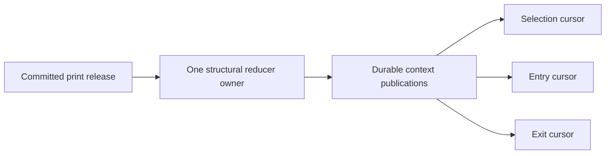

# Durable shared structural observations — project9 [13]/[29]

The actual ordinary context owner can now bind a durable publication sink while
cold. It publishes a validated immutable snapshot before exposing that snapshot
in memory. Separate selection/entry/exit processes can read the exact recorded
calculations and ordered source events instead of independently reconstructing
the tape. The normal entry/exit rules are not wired to this service yet.

## Publication and writer ownership

Migration382 adds stream heads, immutable publications and consumer offsets.
Migration381 remains the separate input print journal;379/380 remain reserved
for the pending quote/task37 work. Neither migration was applied to the running
lane during this build. Tests create tables only in isolated throwaway schemas.

`ContextJournalWriter.create` takes a PostgreSQL session advisory lock on the
stream and retains that connection. Every publication verifies the same backend
and held lock, validates the expected head, then inserts the complete payload,
advances the head using compare-and-swap and sends a tiny wake notification in
one transaction. Losing the session/lock closes the writer; it does not silently
reconnect or reacquire ownership. A second writer is rejected. An existing stream
requires owner reconstruction; creating a new empty owner under its old name is
explicitly refused.

The context revision differs from the source print-release revision. Demand or
health changes may publish a new context while the source revision is unchanged.
Those publications retain the latest source view but expose no `new_events`.
Recording HELD after a peak event does not create a second occurrence of the peak.
An identical observation is not republished. Provider completeness and order
authority remain false in this observation contract.

Publication failure rolls back the output transaction, releases the writer fence
and makes the owner non-runnable. The in-memory reader sees only the previously
published view marked unresolved. If input reduction had already committed in
private memory, it cannot continue from that unpersisted state. An uncertain DB
commit also requires reconciliation; the producer never blindly retries it.

## Exact transport and slow consumers

The payload codec uses a fixed registry of record types; it does not dynamically
import classes or evaluate serialized code. Integer IDs remain integers, tuples
remain immutable and rational flow mass uses exact numerator/denominator strings.
Canonical payload hashes, previous roots, contiguous revisions and terminal-head
checks bind the retained stream. The codec rejects malformed structural records,
inconsistent phase mass, duplicate JSON keys and fabricated authority flags.
These checks validate recorded observation structure, not upstream authenticity.

Readers use a repeatable-read snapshot with their own context cursor. They obtain
every full publication after that cursor, including intermediate birth/breach
events. Byte capacity is checked from database metadata before fetching payload
text. A page ends at the last whole publication that fits; if the first remaining
publication alone exceeds capacity, the reader reports an explicit error.
Neither a skipped revision nor a missing/changed anchor is silently accepted.

Notifications are wake hints only. A lost/coalesced notification cannot erase a
durable publication. `writer_present` reports the current fence observation, not
provider freshness, a heartbeat guarantee, or trade eligibility. Historical
context can be replayed after the writer stops, but it cannot certify a currently
healthy trading source merely because the last stored status was observed.

`acknowledge` checks delivered publication evidence and compare-and-swaps a
consumer's offset in the caller's transaction. Processing that rolls back also
rolls back the offset. Two workers cannot both advance the same expected cursor.
The actual decision/outbox must join this transaction when trading consumers are
connected; an offset alone proves neither an executed decision nor an exactly-once
external broker side effect. Broker transport retains independent protections.

## Verified scope and remaining integration

The first owner/journal batch had28 passed and one reader-capacity failure: a later
oversized publication prevented returning an already complete smaller prefix.
The correction returns that prefix and reports the oversized next publication
when it becomes first in the subsequent read. The corrected durable/source/owner
batch passed43 tests in39.92s. Final durable/wake/CAS/schema/migration checks passed
25 tests in25.99s. Counts overlap and are not a whole-project suite result.

Coverage includes an actual second Python process reading the identical snapshot
with reducer methods disabled; slow readers and independent offsets; event
non-duplication on demand changes; transactional output rollback; consumer
rollback/restart; competing writers and lost locks; retained-data corruption and
deletion; byte bounds; exact-rational transport; commit-coupled NOTIFY; competing
consumer CAS; schema idempotence and migration number uniqueness.

Consumer restart/catch-up is implemented. **Warm reducer-owner recovery is not.**
The next recovery change must retain replayable input capsules: original source
membership, original observation clock, demand-source revisions, anchor/resource
configuration and code identity. Rebuild and compare the exact durable output
frontier under the writer fence before resuming. Do not guess a past receipt clock
from current time or recreate a warm owner from only its last-print snapshot.
That would change its prefix and omit historical structure.

Then finish provider subscription ownership and application lifecycle; bind
selected parent/local scope and the tick-native net-opportunity model to actual
selection/entry/exit consumers; keep Ross benchmark-only; integrate crypto native
decimal/reported-side data and fractional PAPER execution; complete independent
adversarial reviews, verification and coordinated rollout. No lane restart,
strategy activation, crypto order or profitability claim follows from these tests.
