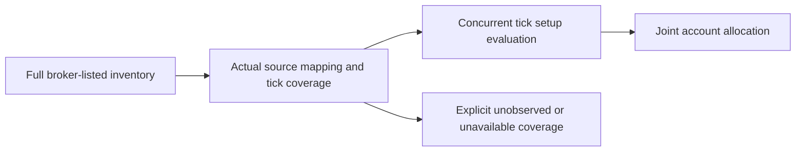

# Full broker inventory before tick qualification

`AlpacaSpotAdapter.get_asset_inventory_probe()` requests the entire active equity
and crypto catalogs through the existing PAPER-only, account-pinned client.
It verifies fresh account identity before and after both catalog calls. Only
`asset_class` and `status=active` are supplied; there is no exchange, price,
volume, Ross score, setup or top-N filter.

The broker's documented `get_all_assets` endpoint returns asset lists with an
optional asset-class/status filter: [Alpaca SDK assets](https://alpaca.markets/sdks/python/api_reference/trading/assets.html)
and [request fields](https://alpaca.markets/sdks/python/api_reference/trading/requests.html).
The result is the broker-reported catalog for those two requested classes, not
an independent proof of every instrument in the world or a market-wide tick feed.

## Preserved facts and failure semantics

The immutable catalog retains every returned active asset, including assets
marked non-tradable. Listing identity is `(asset_class, broker symbol)` plus the
broker asset UUID. Symbols such as dotted/hyphenated equities and non-USD crypto
pairs are preserved without inventing provider aliases. SDK metadata is retained
as delivered; it is not asserted to be original wire bytes or current executable
quantity/price authority. Crypto increments are not replaced with whole-share
defaults. Separate requested classes retain their actual observation intervals;
two catalog HTTP reads are not a broker transaction or atomic market snapshot.

Duplicate identities, ambiguous class aliases, missing tradability, wrong class
or status, a non-list response, a missing class and a changed account pin refuse
the whole new inventory. A class failure cannot publish a partial replacement.
`InventoryProbe` distinguishes a successful empty catalog from unavailable data.
`InventoryBook` retains its complete last success on refresh failure, marks the
attempt unavailable, serializes updates and refuses account/observation regression.
A successful empty inventory can clear that membership only; it cannot clear a
separate held/pending demand source. The book is process-local; its durable
publication and provider-owner lifecycle still need integration.

Order authority is false. Asset-level tradability is not account readiness,
funding availability, tick coverage, setup quality or expected profit. Holding a
USD paper account does not imply that every non-USD crypto pair is immediately
funded. The later execution lifecycle must honor the actual quote-asset balance,
fees, fractional quantities, protections and broker restrictions.

## Measured PAPER catalog and verification

The actual adapter GET-only verification at 2026-09-12T06:18:33.066197+00:00 returned:

| Class | Active listings retained | Broker marked tradable |
|---|---:|---:|
| US equities | 14,308 | 13,435 |
| Crypto | 73 | 73 |

All 14,381 returned records also parsed through the installed Alpaca SDK models.
The crypto quote assets were BTC, USD, USDC and USDT. This is inventory evidence;
current valid tick coverage and profitable opportunity counts were not measured.
The actual adapter run allowed only HTTPS GETs to PAPER account/assets routes,
blocked redirects/other hosts/methods, made three account GETs (including client
pin initialization) and two asset GETs, and placed no orders. The source setting
was the saved lane configuration; the running lane was not changed or restarted.

The initial inventory/identity/adapter batch had78 passed and one neighboring
order-lookup fixture failure in30.05s. The same failure reproduced on main4f75f0a0
in4.05s: the fake lookup lacked the existing `filter=nested` argument, so it raised
TypeError before simulating broker404/503. The fixture now accepts that argument
and asserts nested order lookup remains requested. Final targeted checks passed
79 tests in25.12s. Counts overlap. Tests use chili_rossbench26_test; no whole suite.

## Integration still required

The new complete inventory probe is implemented and verified against the actual
PAPER endpoint. The active selection/subscription callers still use their older
viability/profile/age/limit path; the legacy `get_products()` interface is unchanged.
Do not report the broader catalog as already subscribed, evaluated or tradable
under a CHILI setup. Next bind full inventory and independent account held/pending
demands to one durable provider/context lifecycle, account for every mapping or
capacity gap, and connect actual selection/entry/exit consumers to the same tick
revision. Qualified concurrent opportunities then use joint account allocation;
no ranking gate should hide independent opportunities before tick evaluation.
Review, integration verification and coordinated PAPER deployment remain required.
